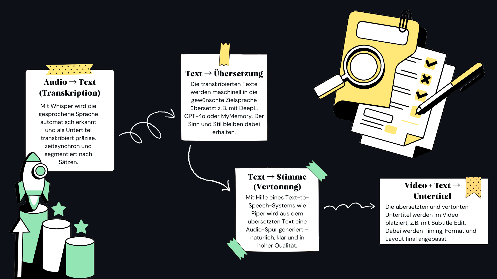

# 🎙️ VST-VoiceOver – Voiceover Subtitle Translation Workflow

Dieses Projekt bietet einen vollständigen Workflow zur automatisierten Erstellung von Untertiteln und Voiceovers auf Basis moderner KI-Modelle (Whisper, DeepL, GPT, TTS).

Ziel ist es, **mehrsprachige Videoübersetzungen mit Voiceover** effizient, reproduzierbar und in hoher Qualität zu erstellen vom Transkript bis zur finalen vertonten Videodatei.

---

## 📁 Projektübersicht: Wichtige Ordner im Repository

| Ordner / Datei                | Inhalt                                                                                           |
|-------------------------------|---------------------------------------------------------------------------------------------------|
| `config/`                     | Konfigurationsdateien für Whisper, Subtitle Edit, TTS-Modelle (z. B. `.xml`, `.profile`)             |
| `notebooks/`                  | Jupyter Notebooks zur Analyse, Modellvergleich und BLEU-Messung                                  |
| ├── `jupyter_scripts/`        | Zusätzliche Hilfsskripte für Datenvorbereitung, Vergleich und Visualisierung                     |
| ├── `outputs/`                | Generierte Ausgaben und Zwischenergebnisse aus Notebook-Auswertungen                             |
| ├── `translate_models/`       | Enthält gespeicherte Übersetzungsmodelle (z. B. DeepL, GPT, Ollama usw.)                 |
| └── `whisper_models/`         | Enthält Whisper-Modelle (z. B. `tiny`, `base`, `large`, `turbo`) für die automatische Transkription  |
| `images/`                     | Visualisierungen des Workflows und Screenshots zur Dokumentation                                 |
| `docs/`                       | Enthält Markdown-Dokumente sowie die finale Projektpräsentation als PDF               |
| `README.md`                   | Hauptübersicht über das Projekt, Struktur und Einstiegspunkt                                     |

---

## 📄 Verlinkte Projektdokumente

 📘 [`workflow.md`](/workflow.md) – Vollständiger Arbeitsablauf von Transkription bis Export  
 🛠️ [`semantic_setup_guide.md`](/notebooks/semantic_setup_guide.md) – Einrichtung der Python-Umgebung für semantische Analyse und Visualisierung  
 📊 [`model-review.md`](/model-review.md) – Modellvergleich, BLEU-Werte, Ähnlichkeitsanalysen  
 🧾 [`final_model_report.md`](/final_model_report.md) – Zusammenfassung der finalen Konfigurationen und Ergebnisse  
  🧬 [`voice_cloning.md`](/voice-cloning.md) – Anleitung zur lokalen Stimmerstellung mit Piper (Training & Export)  
 🎙️ [`voice_recording.md`](/voice-recording.md) – Anleitung zur Sprachaufnahme mit dem Piper Recording Studio (mind. 200 Samples) 
  
---

## 🧭 Überblick: Visueller Workflow zur Erstellung von Voiceover-Untertiteln

  

Die Grafik zeigt den typischen Ablauf in vier Schritten – von der Spracherkennung bis zur finalen Platzierung der Untertitel im Video:

1. **Audio → Text (Transkription)**  
   Automatische Umwandlung gesprochener Sprache in geschriebenen Text mit Whisper – präzise, zeitsynchron und satzweise segmentiert.

2. **Text → Übersetzung**  
   Maschinelle Übersetzung in die gewünschte Sprache, z. B. mit DeepL, GPT-4o oder MyMemory.

3. **Text → Stimme (Vertonung)**  
   Mit einem TTS-System (z. B. Piper) wird aus dem übersetzten Text eine klare Audio-Spur erzeugt.

4. **Video + Text → Untertitel**  
   Einfügen der übersetzten und vertonten Untertitel in das Video, z. B. mit Subtitle Edit – inkl. finalem Feinschliff bei Timing, Format und Layout.

## Workflow for Voiceover
This workflow works with the tool subtitleedit from  
niksedk  (https://github.com/SubtitleEdit/subtitleedit/commits?author=niksedk) 

## SubtitelEdit
load Video
- transcribe with whisper (without autotranslate)
- use settings VST-Voice over Workfow
- use spell checking if needed for the original and translated voice
- save srt file
  
a good alternative side for exact timing translations can be found here
- translate: https://translatesubtitles.co/translatesub.php?srt=Stabilizing_de.srt

