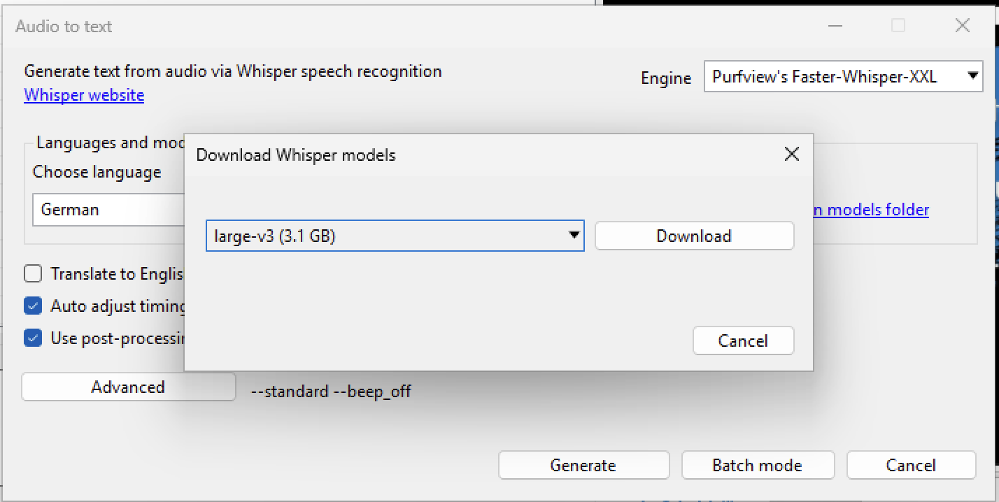
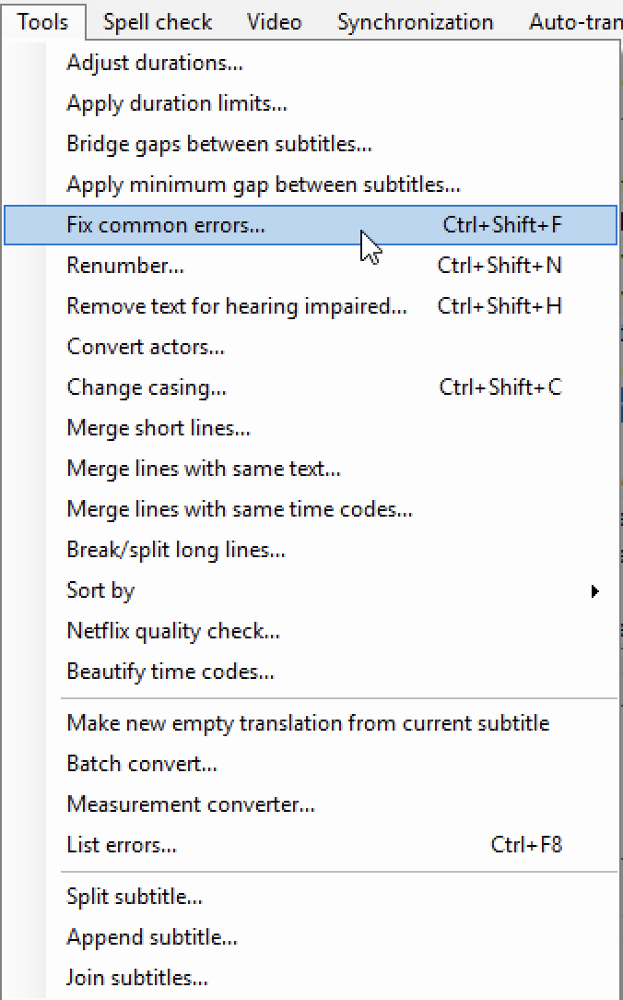

# 📋 Projekt-Workflow: Subtitle Edit

Willkommen zu diesem Workflow-Dokument für **Subtitle Edit** – einem leistungsstarken Tool zur Bearbeitung und Erstellung von Untertiteln.

Dieses Leitdokument führt Sie Schritt für Schritt durch den gesamten Produktionsprozess:  
Von der **Installation** und den **Grundeinstellungen**, über das **Importieren, Transkribieren und Übersetzen** von Videomaterial, bis hin zur **Synchronisierung, Vertonung und finalen Ausgabe** der Untertitel.

Der Workflow ist sowohl für Einzelpersonen als auch für Teams gedacht, die strukturiert und reproduzierbar mit Videotext arbeiten möchten.

---
## 🧭 Übersicht: Die vier Hauptschritte im Workflow

Dieser Workflow gliedert sich in **vier zentrale Arbeitsschritte**, die jeweils durch eigene Kapitel detailliert beschrieben werden:

| Schritt | Titel | Beschreibung |
|--------|-------|--------------|
| **1️⃣** | [🎙️ Transkription: Video → Text](#schritt-1-transkription--vom-video-zum-text) | Mit Whisper automatisch Text aus dem Video extrahieren |
| **2️⃣** | [🌍 Maschinelle Übersetzung: Text → Sprache](#schritt-2-maschinelle-übersetzung--text--übersetzung) | Untertitel mit DeepL, Google oder lokalen Modellen übersetzen |
| **3️⃣** | [🔊 Text-to-Speech: Text → Audio](#text-to-speech--optional) | (optional) Vertonung der Texte mit z. B. Piper oder ElevenLabs |
| **4️⃣** | [🧹 Fehlerprüfung & Export](#automatische-fehlerprufung--korrektur-von-untertiteln) | Untertitel auf Qualität prüfen und korrekt abspeichern/exportieren |


---

> ✅ **Zielgruppe:**  
> Dieser Leitfaden richtet sich an Videoeditoren, Content-Creators, E-Learning-Teams und alle, die mit mehrsprachigen oder barrierefreien Untertiteln arbeiten.

---

> 📁 **Dateiformate & Kompatibilität:**  
> Unterstützt werden `.srt`, `.vtt`, `.ass`, `.sub` und viele weitere Formate – sowie Integration mit Whisper, DeepL, Google Translate und TTS-Modulen wie Piper.

---

 ## 🛠️ Installation

Um loszulegen, installiere **Subtitle Edit** auf deinem System.

### 1️⃣ Neueste Version herunterladen

Besuche das offizielle Repository:

👉 [Subtitle Edit GitHub Releases](https://github.com/SubtitleEdit/subtitleedit/releases)

Lade den Installer für dein Betriebssystem herunter (Windows, MacOS oder Linux).

### 2️⃣ Installation via Git (optional)

Falls du das Projekt direkt klonen möchtest:

```bash
git clone https://github.com/SubtitleEdit/subtitleedit.git
cd subtitleedit
```

### 🏁 Anwendung starten

Nachdem du das Projekt geklont hast, **navigiere zum Ordner mit der ausführbaren Datei.**.  
Unter Windows ist dies typischerweise eine Datei wie `SubtitleEdit.exe` or `SubtitleEditBeta.exe`.  
👉 **Einfach doppelklicken, um das Programm zu starten!**

Keine zusätzlichen Build-Schritte erforderlich, wenn du die vorgefertigte Version heruntergeladen hast (z.B. .exe für Windows oder das entsprechende Binary für MacOS/Linux).


> **Abbildung 1: Benutzeroberfläche von Subtitle Edit**

### 🔍 Aufbau der Oberfläche

- **Oben (Menüleiste):** Zugriff auf alle Hauptfunktionen wie  
  `File`, `Edit`, `Tools`, `Spell check`, `Video`, `Synchronization`, `Auto-translate`, `Options`, `Networking`, `Help`

- **Oben links (Tabelle):** Die Untertitelzeilen – mit Spalten für `Start time`, `End time`, `Duration`, `Text`  
  → Hier bearbeiten Sie alle Untertitel zeitlich und inhaltlich.

- **Rechts oben:** Der integrierte Videoplayer mit Wiedergabesteuerung.

- **Rechts unten:** Audiowellenform zur präzisen zeitlichen Zuordnung der Untertitel – nützlich für Feinanpassungen.

- **Unten (Steuerung & Suche):** Optionen für automatische Wiederholung (`Auto repeat`),  
  sowie Online-Suchfunktionen (`Google`, `Google translate`, `Wikipedia` etc.)

> 🧠 **Tipp:** Achten Sie auf die Buttons `Select current subtitle while playing` und Zoomstufen – diese helfen bei der präzisen Synchronisation.

---
---

## ⚙️ Einstellungen vor dem Start anpassen

Bevor Sie mit dem Importieren, Transkribieren oder Übersetzen beginnen, sollten Sie sicherstellen, dass die **Grundparameter für Untertitelqualität** korrekt gesetzt sind. Diese Einstellungen beeinflussen direkt:

- die Lesbarkeit,
- die Dauer einzelner Untertitelzeilen,
- die maximale Zeichenzahl pro Zeile und Sekunde,
- sowie automatisierte Formatierungsfunktionen.

Sie finden diese Optionen im Menü:  
👉 **Options → Settings → General**


📷 *Abbildung 2: Einstellungen im Bereich `General`. Hier können Sie zentrale Werte für Lesbarkeit und Untertitelformat anpassen.*

---

### 🔢 Empfohlene Startwerte für die wichtigsten Parameter
| Einstellung in Subtitle Edit        | Empfohlener Bereich           | Beschreibung / Funktion                                                                 |
|------------------------------------|-------------------------------|------------------------------------------------------------------------------------------|
| **Single line max. length**        | `42 – 60` Zeichen             | Zeilen über 60 Zeichen sind schwerer lesbar; ideal: max. 2 Zeilen à 35–40 Zeichen        |
| **Optimal chars/sec**              | `12,0 – 15,0`                 | Idealwert für Lesbarkeit (nicht zu schnell)                                              |
| **Max. chars/sec**                 | `18,0 – 25,0`                 | Obergrenze – > 20 wird meist als kritisch markiert                                       |
| **Max. words/min**                 | `160 – 200`                  | Optional: Lesetempo (nicht immer aktiv)                                                  |
| **Min. duration (ms)**             | `1000 – 1500`                 | Untertitel sollen mind. 1 Sekunde sichtbar sein                                          |
| **Max. duration (ms)**             | `6000 – 8000`                 | Ab ~7–8 Sek. wird es für Dialoge zu lang                                                 |
| **Min. gap between subtitles (ms)**| `12 – 24`                     | Mindestabstand zwischen Untertiteln, um Flackern zu vermeiden                           |
| **Max. number of lines**           | `2`                           | Mehr als zwei Zeilen sind nur in Ausnahmefällen akzeptabel                              |
| **Unbreak subtitles shorter than** | `30 – 40`                     | Kurze Untertitel werden nicht umgebrochen (z. B. bei Einzeilern)                        |
| **Default file encoding**          | `UTF-8 with BOM`              | Empfohlen für internationale Kompatibilität                                              |

---

> 💡 **Tipp:** Wenn Sie andere Exportstandards verwenden (z. B. Netflix, YouTube, barrierefrei), können diese Werte leicht variieren.  
> Subtitle Edit erlaubt es, diese Profile unter **Rules → Profile** zu speichern oder zu laden.

---
## 🎞️ Projekterstellung

Nachdem du **Subtitle Edit** erfolgreich installiert und gestartet hast, beginnt dein Workflow mit dem **Anlegen eines neuen Projekts und dem Hochladen des Videos**, das du bearbeiten möchtest.

---

## 🔄 Gesamtübersicht: Der Untertitel-Workflow

Ein vollständiger Untertitel-Workflow in diesem Projekt besteht aus vier Schritten:

1. **🎙️ Video → Text:** Automatische Transkription mit Whisper  
2. **🌍 Text → Übersetzung:** Maschinelle Übersetzung der Untertitel (z. B. nach Englisch)  
3. **🔊 Text → Sprache:** Vertonung per Text-to-Speech (TTS, z. B. mit Piper)  
4. **🧩 Integration:** Untertitel finalisieren und ins Video integrieren (z. B. als `.srt`, `.ass` oder Hard-Sub)

---

<a name="transkription-video-text"></a>
<h2>🎤 Schritt 1: Transkription – vom Video zum Text</h2>

In diesem Abschnitt lernst du, wie du mit **Subtitle Edit** und **Whisper** automatisch Untertitel erzeugst – direkt aus einem Video, ohne manuelles Tippen.  
Mit nur wenigen Klicks wird Sprache erkannt, segmentiert und als Zeit-basierter Untertiteltext dar

### 1️⃣ Video laden

👉 Klicke im oberen Menü auf **`Video` → `Open video file...`**  
Wähle anschließend die gewünschte Videodatei von deinem Computer aus.


📷 *Abbildung 3:* Diese Auswahl öffnet einen Dateidialog, mit dem du das gewünschte Video laden kannst. Danach wird die Benutzeroberfläche erweitert und zeigt das Video rechts oben im Vorschaufenster.

---

## 🎬 Arbeitsbereich für Untertitel: Player, Audio und Textzeilen

Nach dem erfolgreichen Laden des Videos erscheint das Hauptfenster mit aktiver Videovorschau und Wellenformanzeige.


📷 *Abbildung 4:*  
- **Oben rechts**: Der Videoplayer mit Play-Steuerung.  
- **Unten**: Die Audiowellenform zur zeitlich präzisen Synchronisation.  
- **Links oben**: Die Untertiteltabelle mit Spalten für Startzeit, Endzeit, Dauer und Text.

---

## 🧠 Automatische Transkription mit Whisper

Wenn du die Untertitel nicht manuell schreiben möchtest, kannst du die Funktion **„Audio to text (Whisper)“** verwenden. Damit wird der gesprochene Ton im Video automatisch in Text umgewandelt.

### 2️⃣ Transkription starten

👉 Menü: **`Video` → `Audio to text (Whisper)...`**


📷 *Abbildung 5:* Wähle diese Option, um Whisper-basierte Spracherkennung zu starten.

---

### 3️⃣ Whisper-Konfiguration

Nach dem Klick öffnet sich das Konfigurationsfenster für Whisper. Hier kannst du Sprache, Modellgröße und weitere Optionen wählen.


📷 *Abbildung 6:*  
- **Choose language:** Wähle z. B. `German`
- **Choose model:** Wähle ein Modell wie `large-v3 (3.1 GB)`
- Aktiviere:
  - ⬜ `Translate to English` *(nicht aktiviert im Screenshot)*
  - ⬜ `Auto adjust timings` *(nicht aktiviert im Screenshot)*
  - ✅ `Use post-processing` *(aktiviert: automatische Groß-/Kleinschreibung, Zeichensetzung etc.)*

> ℹ️ Unten siehst du eine automatisch generierte Parameterzeile, die auf deine Auswahl basiert.  
> Für präzisere Steuerung kannst du auf **Advanced** klicken und manuelle Werte setzen (siehe nächster Schritt).
---

### ℹ️ Verfügbare Modelle im Überblick

Du kannst aus verschiedenen Whisper-Modellen wählen – je größer das Modell, desto besser die Qualität, aber auch höher der Speicherverbrauch und längere Laufzeiten.


📷 *Abbildung 7:* Modellübersicht von `tiny`, `base`, `small`, `medium` bis zu den hochwertigen Modellen `large-v1`, `large-v3` und `large-v3-turbo`.

> 💡 **Empfehlung:**  
> Für professionelle Ergebnisse eignet sich besonders `large-v3`.  
> Für Tests oder leistungsschwache Rechner bieten sich `base` oder `small` an.

---

### ℹ️ Modell herunterladen

Falls du das gewünschte Modell noch nicht installiert hast, kannst du es direkt in Subtitle Edit herunterladen.



📷 *Abbildung 8:* Wähle z. B. `large-v3 (3.1 GB)` aus der Liste und klicke auf **Download**.  
Nach erfolgreichem Download kannst du mit dem Transkriptionsvorgang beginnen.

---
### 4️⃣ Erweiterte Whisper-Parameter (empfohlen für bessere Ergebnisse)

Wenn du besonders hochwertige Transkriptionen mit Whisper erzeugen möchtest, lohnt sich die Anpassung der sogenannten **„Advanced Settings“**. Diese beeinflussen, wie das Modell Sprache erkennt, trennt und wiedergibt.


📷 *Abbildung 9:* Beispielkonfiguration im Whisper-Fenster – die zusätzlichen Parameter erscheinen unten als Textzeile und können über „Advanced“ angepasst werden.

---

#### 💡 Empfohlene Einstellungen für Faster-Whisper (z. B. Purfview XXL):

| Parameter               | Empfohlener Wert / Aktivierung | Beschreibung                                                                 |
|------------------------|-------------------------------|------------------------------------------------------------------------------|
| `--sentence`           | *(aktivieren)*                | Erkennt vollständige Sätze statt nur Blöcke – **bessere Segmentierung**.     |
| `--vad_method`         | `pyannote_v3` oder `silero_v3` | Methode zur **Spracherkennung** (Voice Activity Detection).                  |
| `--vad_threshold`      | `0.4 – 0.6`                   | Niedriger = empfindlicher bei Erkennung (hilft bei Satzenden).              |
| `--no_speech_threshold`| `0.7 – 0.85`                  | Steuert, wann **„Stille“** erkannt wird.                                     |
| `--max_silent_period`  | `2.0 – 2.5 Sekunden`          | Erlaubt längere Pausen – wichtig bei langsamem Sprechen.                     |
| `--beam_size`          | `5 – 10`                      | Mehr Vorschläge → **bessere Wortwahl und Satzende-Erkennung**.              |
| `--temperature`        | `0.0 – 0.2`                   | Niedriger = stabiler, **weniger Zufall** in der Wortwahl.                   |
| `--word_timestamps`    | *(optional, aktivieren)*      | Zeigt **Start-/Endzeiten jedes Wortes** an – nützlich zur Kontrolle.        |

---

### 🔧 So aktivierst du diese Optionen

- Klicke im Whisper-Fenster auf **„Advanced“**.
- Trage dort deine Parameter ein, z. B.:

```bash
--sentence --vad_filter true --word_timestamps true --temperature 0.0 --beam_size 8
```

📄 **Optional: XML-Konfigurationsdatei**

Wenn du deine Whisper-Einstellungen dauerhaft speichern oder in mehreren Projekten verwenden möchtest, kannst du sie als XML-Datei sichern.

👉 Beispielkonfiguration findest du hier:  
[Download whisper_config.xml](path/to/whisper_config.xml)

> 💡 **Tipp:** Du kannst diese Datei direkt über den "Advanced"-Dialog in Subtitle Edit laden oder bearbeiten.

---

## ⚙️ Wichtige Zusatzinstallationen

Je nach System zeigt Subtitle Edit zusätzliche Hinweise an – diese solltest du akzeptieren:

### 🎥 MPV Videoplayer installieren


📷 *Abbildung 10:* Klicke auf **Download and use "mpv" as video player**, um eine funktionierende Vorschau zu erhalten.

---

---
### 🔊 FFmpeg für Audiowellenform


📷 *Abbildung 11:* Klicke auf **Yes**, um FFmpeg zu installieren. Dieses Tool wird für die Darstellung der Audiowellenform benötigt.

---

### ⬇️ Whisper-Engine (Faster-Whisper-XXL) installieren


📷 *Abbildung 12:* Bestätige mit **Yes**, um Purfview's Faster-Whisper-XXL herunterzuladen.

---

### ▶️ Generierung starten

Wenn alles eingerichtet ist, können Sie auf **Generate** klicken, um die automatische Untertitelung zu starten.  
Je nach Modellgröße und Videolänge dauert die Transkription zwischen wenigen Sekunden und mehreren Minuten.

> 🧠 **Tipp:** Nach der Generierung können Sie die Zeitstempel mithilfe der Audiowellenform präzise anpassen  
> oder automatisch über **`Synchronization → Adjust all times`** optimieren lassen.

---

## 🧹 Automatische Fehlerprüfung & Korrektur von Untertiteln

Nachdem Sie Untertitel generiert oder importiert haben, zeigt **Subtitle Edit** visuelle Hinweise auf mögliche Probleme – z. B. zu lange Dauer, zu viele Zeichen pro Sekunde oder überlange Textzeilen.

---
<!--  -->

### 🔍 Visuelle Fehlererkennung


📷 **Abbildung 13:**  
In dieser Tabelle sind mehrere Zeilen **rot markiert** – das weist auf Fehler hin, z. B.:

- 🕒 **Duration** zu lang (z. B. `9,020` ms)
- 🔤 **Chars/sec** über Grenzwert (z. B. `> 15`)
- 📏 **Textlänge** zu hoch (z. B. `Total length: 103` oder `52/51` Zeichen pro Zeile)

> ℹ️ Diese Fehler basieren auf den Grenzwerten unter `Options → Settings → General`. Sie können individuell angepasst werden.

---

### 🧰 Fehler automatisch beheben

**Subtitle Edit** bietet ein Tool zur automatischen Korrektur der häufigsten Probleme:

👉 Menü: **`Tools → Fix common errors...`**



📷 **Abbildung 14:** Menüpunkt zur automatischen Fehlerkorrektur.

---

### 🛠️ Schritt 1 von 2: Fehlerarten auswählen

Im nächsten Dialogfenster können Sie auswählen, welche Fehlertypen Subtitle Edit korrigieren soll.


📷 **Abbildung 15:**  
Häufig genutzte Fixes:

- Entfernen leerer Zeilen / Zeilenumbrüche  
- Anpassen zu langer Display-Zeiten  
- Entfernen doppelter Leerzeichen  
- Groß-/Kleinschreibung nach Punkten

> ✅ Die meisten Standardfehler sind bereits vorausgewählt – Sie können jederzeit weitere Optionen aktivieren oder deaktivieren.

### ✅ Empfohlene Fehlerprüfungen in Subtitle Edit

| Fehlerprüfung / Funktion                           | Empfehlung | Beschreibung / Wirkung                                                      |
|----------------------------------------------------|------------|-----------------------------------------------------------------------------|
| Remove empty lines / unused line breaks            | ✅ Ja       | Entfernt unnötige Leerzeilen – verbessert Formatierung                      |
| Fix overlapping display times                      | ✅ Ja       | Verhindert gleichzeitige Anzeige mehrerer Untertitel                        |
| Fix short display times                            | ✅ Ja       | Verlängert sehr kurze Anzeigedauer (weniger als 1 Sekunde)                  |
| Fix long display times                             | ✅ Ja       | Reduziert überlange Anzeigezeiten (z. B. > 7–8 Sekunden)                    |
| Fix short gaps                                     | ✅ Ja       | Setzt Mindestabstand zwischen Untertiteln, vermeidet Flackern              |
| Fix invalid italic tags                            | ✅ Ja       | Korrigiert HTML-Fehler wie `<i>` ohne korrekten Abschluss                   |
| Remove unneeded spaces                             | ✅ Ja       | Entfernt doppelte oder falsche Leerzeichen                                  |
| Fix missing spaces                                 | ✅ Ja       | Fügt fehlende Leerzeichen nach Satzzeichen ein                              |
| Fix commas                                         | ⬜ Optional | Vereinheitlicht Kommasetzung, z. B. in Listen                               |
| Remove unneeded periods                            | ⬜ Optional | Entfernt überflüssige Punkte (z. B. nach jedem Wort)                        |
| Break/split long lines                             | ✅ Ja       | Teilt sehr lange Zeilen automatisch um                                      |
| Fix subtitles with more than two lines             | ✅ Ja       | Kürzt oder splittet Blöcke mit mehr als 2 Zeilen                            |
| Add period after line ends with uppercase          | ✅ Ja       | Ergänzt fehlende Satzzeichen bei Absätzen                                   |
| Start with uppercase after colon or semicolon      | ✅ Ja       | Stellt korrekte Großschreibung nach `:` oder `;` sicher                     |
| Replace music symbols (♫ etc.)                     | ⬜ Optional | Ersetzt Unicode-Symbole durch standardisierte Varianten                     |
| Remove line breaks in short texts (except dialogs) | ✅ Ja       | Setzt kurze Sätze wieder in eine Zeile für bessere Lesbarkeit               |
| Start with uppercase after paragraph               | ✅ Ja       | Stellt sicher, dass neue Sätze groß beginnen                                |


> 🧠 **Tipp:** Aktivieren Sie nur Funktionen, die **nicht gegen Ihr Formatierungsschema oder den Kundenguide** verstoßen – z. B. keine Musiksymbolersetzung bei kreativen Projekten oder Lyrik.

---

### 🔍 Schritt 2 von 2: Vorschau der Korrekturen

Subtitle Edit zeigt nun konkrete Korrekturvorschläge – mit `Before`-/`After`-Vergleich pro Zeile.


📷 **Abbildung 16:**  
In diesem Beispiel wurde eine zu lange Dauer (`9,020`) auf `8,000` reduziert.  
Unten sehen Sie die **betroffene Untertitelzeile**, inklusive neuer Zeitwerte und optimierter Lesbarkeit.


---

### ✅ Korrekturen übernehmen

Wenn Sie mit den Änderungen zufrieden sind, klicken Sie auf:

🔘 **Apply selected fixes**

Damit werden alle aktivierten Korrekturen direkt auf Ihre Untertitel angewendet.

---

> 💡 **Tipp:**  
> Nutzen Sie „Fix common errors...“ am besten **nach jeder automatischen Transkription oder Übersetzung**,  
> um Ihre Untertitel leserfreundlich, regelkonform und bereit für den Export zu machen.

## 🌍 Schritt 2: Maschinelle Übersetzung – Text → Übersetzung

Nach der erfolgreichen Transkription möchten Sie Ihre Untertitel oft in eine andere Sprache übersetzen – z. B. von Deutsch ins Englische.  
**Subtitle Edit** unterstützt hierfür eine Vielzahl von APIs – darunter Google, DeepL, ChatGPT, OpenRouter und viele mehr.

---

### 1️⃣ Auto-Translate aufrufen

👉 Menü: **`Auto-translate → Auto-translate...`**


---

### 2️⃣ Übersetzungsdialog konfigurieren

Wählen Sie die gewünschte **API**, **Ausgangs- und Zielsprache**.  
Standardmäßig steht Google Translate zur Verfügung, viele weitere Dienste lassen sich ergänzen.


---

### 3️⃣ Übersetzungsdienst wählen

Subtitle Edit unterstützt viele Dienste – kostenlos, lokal oder mit API-Key:


Beispiele für verfügbare Übersetzer:

| Dienst                  | Typ           | Hinweis                                  |
|------------------------|---------------|------------------------------------------|
| Google Translate V1/V2 | Extern (API)  | ⚠️ Schlechte Wahl: Begrenztes Freikontingent, oft ungenau |
| DeepL V2               | Extern (API)  | ✅ Höchste Qualität, Registrierung nötig |
| ChatGPT, Claude, Gemini| OpenRouter    | 🌐 Via OpenRouter API nutzbar            |
| Ollama, LM Studio      | Lokal         | 🖥️ Lokale LLMs, keine Internetverbindung |
| LibreTranslate         | Selbst-hostbar| 🛠️ Für eigene Server                     |

---

### 4️⃣ DeepL API verwenden (Beispiel)

Um DeepL zu nutzen, benötigen Sie:

- Ihre **API-URL** (z. B. `https://api-free.deepl.com/`)
- Einen **gültigen API-Key** (kostenlos erhältlich über [DeepL API](https://www.deepl.com/pro))


---

### 5️⃣ Übersetzung starten

Sobald die Konfiguration steht, klicken Sie auf **Translate**.


Die rechte Spalte füllt sich mit der maschinellen Übersetzung.  
Rote Markierungen weisen auf **Formatierungsprobleme oder Überschreitungen** hin.

---

### 6️⃣ Letzte Qualitätskontrolle

Nach der Übersetzung empfiehlt es sich, die Datei visuell oder automatisch zu überprüfen:


Sie sehen den **Originaltext** und die **Übersetzung** im direkten Vergleich.  
Beachten Sie: Einige Zeilen sind orange hinterlegt – hier überschreiten Textlängen oder Chars/sec den Grenzwert.

---

### 🧹 Qualität sichern: Korrektur durchführen

👉 Führen Sie jetzt die Fehlerkorrektur durch – wie im Kapitel  
**[🧹 Automatische Fehlerprüfung & Korrektur](#🧹-automatische-fehlerprüfung--korrektur-von-untertiteln)**  
beschrieben.

Klicken Sie dazu auf:

🔧 **`Tools → Fix common errors…`**

um typische Probleme automatisch zu beheben (z. B. zu lange Zeilen, falsche Formatierung, HTML-Fehler).

---
### 💾 Untertiteldateien speichern

Sobald Ihre Übersetzung abgeschlossen ist – ob automatisch oder manuell – können Sie diese als eigenständige Datei speichern. Das ist notwendig, wenn:

- Sie die Untertitel separat weiterverarbeiten möchten
- eine manuelle Nachbearbeitung oder Sprachvertonung ansteht
- Sie eine **Kopie pro Sprache** archivieren wollen (z. B. `.de.srt` / `.en.srt`)

---

### 1️⃣ Menü „Datei → Save as...“ öffnen

👉 Navigieren Sie zu **`File → Save as...`** oder verwenden Sie den Shortcut `Ctrl + Shift + S`.


📷 *Abbildung 17:* Speichermenü für Untertiteldateien

---

### 2️⃣ Dateiname & Format festlegen

- Wählen Sie einen **aussagekräftigen Dateinamen**, z. B.:  
  `Texturing.Trunk-de-2min.en.srt`  
  → Das `.en` steht hier für *Englisch*
- Als Format empfiehlt sich: `SubRip (*.srt)`  
  (kompatibel mit YouTube, VLC, etc.)


📷 *Abbildung 18:* Speichern Sie die Datei im gewünschten Untertitelformat

---

### 🔁 Weitere Speichermöglichkeiten

Im **File-Menü** finden Sie zusätzliche Optionen:

| Option                                      | Funktion                                                                 |
|--------------------------------------------|--------------------------------------------------------------------------|
| `Save original subtitle`                   | Speichert das ursprüngliche Transkript (z. B. Deutsch)                   |
| `Save original subtitle as...`             | Speichern unter neuem Namen                                              |
| `Close translated subtitle`                | Beendet den aktuellen Tab ohne zu speichern                             |
| `Compare...`                               | Vergleicht Original mit Übersetzung                                      |
| `Restore auto-backup...`                   | Öffnet automatische Sicherungen von Subtitle Edit                        |

---

> 💡 **Tipp:**  
> Trennen Sie klar zwischen den Sprachversionen – das erleichtert späteres Zusammenfügen, Übersetzen oder Vertonen.
